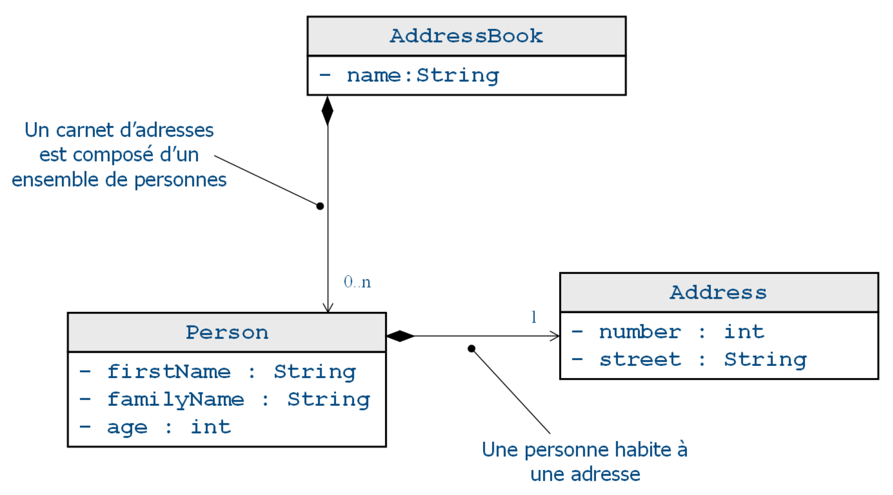

# Exercice 1 (EMF) : création du modèle EMF d’un carnet d’adresses

L'exemple qui illustre cet article est un carnet d'adresses. Ce dernier est identifié par un nom et contient une liste de personnes (`contains`). Une personne est identifiée par un prénom, un nom et un âge. Une personne contient obligatoirement une adresse (`location`). Une adresse est identifiée par un numéro et un nom de rue.

Le modèle UML donné ci-dessous représente graphiquement la modélisation attendue pour cet exercice. Nous nous intéressons ici à créer le modèle UML présenté via les outils d'Eclipse.

## But

* Démarrer un projet EMF ;
* Créer un modèle EMF avec les outils Eclipse ;
* Manipuler les différents éditeurs.

## Étapes à suivre

* Démarrer l’environnement de développement Eclipse qui vous a été fourni (version contenant les plugins de modélisation).

* Créer un nouveau Workspace dont le nom respectera le patron suivant : workspaceEMF_NOM_Prénom où NOM et Prénom désignent votre nom et prénom respectifs (exemple : *workspaceEMF_BARON_Mickael*).

* Ouvrir la perspective Ecore.

* Créer un nouveau projet de type **Ecore Modeling Project** (**File -> New -> Project... -> Eclipse Modeling Framework - > Ecore Modeling Project**).

* Choisir comme nom de projet *eclipse.emf.addressbook* puis faire directement **Finish**.

* Sélectionner le répertoire *model*, puis le nœud *addressbook.ecore* et enfin ouvrir l’éditeur de diagramme de classes en cliquant sur le nœud feuille *addressbook class diagram*.

* Construire les trois classes, définir tous les attributs et créer les associations entre les classes. Veuillez respecter les contraintes de cardinalités exprimées sur le schéma précédent. Vous appellerez `contains` la relation de composition entre les classes `AddressBook` et `Person` (cardinalité 0..n) et enfin `location` la relation de composition entre `Person` et `Address` (cardinalité 1..1).

* Visualiser votre modèle à partir des différents éditeurs (**OCLinEcore (Ecore) Editor**, **Sample Ecore Model Editor**). Si l’éditeur **OCLinEcore** n’est pas installé par défaut, vous pouvez l’ajouter en installant le plugin Eclipse OCL.

* Visualiser finalement votre modèle au format XML, vous remarquerez qu'il s'agit d'un fichier XMI dont les données correspondent à des instances du métamodèle Ecore. Nous reviendrons sur cette notion dans les prochains exercices.