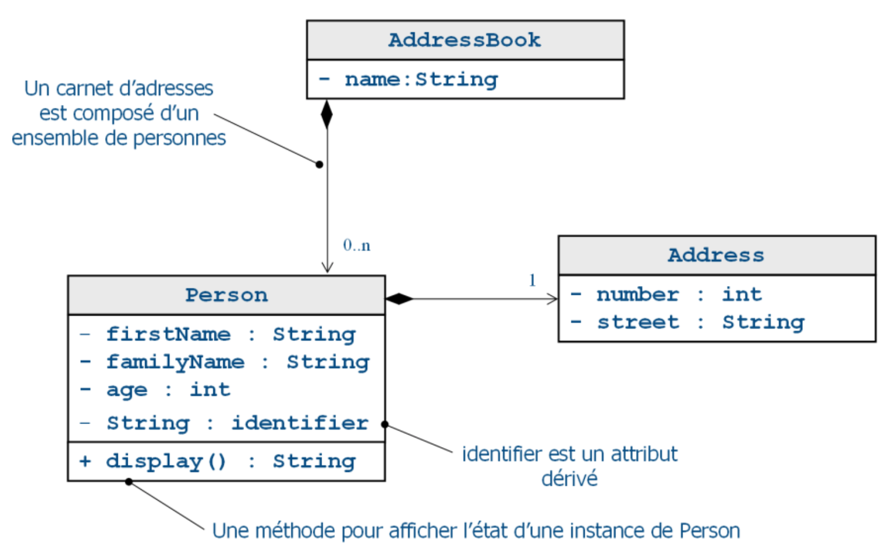

# Exercice 2 (EMF) : génération de codes Java (l’API du métamodèle)

Nous nous intéressons maintenant à toutes les étapes de génération de code à partir d'un modèle EMF. Nous nous intéressons également aux étapes de re-génération et de protection des codes modifiés par le développeur. Un modèle supplémentaire est requis et dédié à cette tâche. Il contient les informations dédiées uniquement à la génération et qui ne pourraient pas être intégrées au modèle EMF (chemin de génération, package, préfixe…). Ce modèle appelé *genmodel* est également un modèle EMF et chaque classe du modèle de génération est un décorateur des classes Ecore.

## But

* Créer un modèle de génération à partir d’un Ecore.
* Paramétrer le modèle de génération de code.
* Générer un code Java correspondant au modèle EMF.
* Mise-à-jour du modèle et re-génération du code généré et modification du code généré.

## Étapes à suivre

* Sélectionner le fichier *addressbook.genmodel* (qui a été généré dans l’exercice précédent) et le visualiser au format XML. Vous noterez une ressemblance avec le contenu du fichier *addressbook.ecore* hormis le fait que le modèle décrit dans *addressbook.genmodel* ne s’appuie pas sur le même métamodèle.

* Visualiser le fichier *genmodel* avec l’outil d’édition **EMF Generator** et modifier le contenu du fichier pour que le package de génération soit `eclipse.emf.addressbook.model` (propriétés : `Base Package`).

* Sélectionner depuis le fichier *genmodel* le package racine `Addressbook` et générer le code Java correspondant au modèle (**Generate Model Code**). Un ensemble de classes Java doivent être générées dans le package `eclipse.emf.addressbook.model`.

* Examiner les classes générées et remarquer le découpage en trois catégories qui font apparaître une programmation par contrats des interfaces et des implémentations.

Nous décidons par la suite de modifier le modèle de façon 1) à ajouter un attribut dérivé dans la classe `Person` appelé `identifier` de type `String` qui retourne une chaîne de caractères de la forme (`firstName + familyName + age`) 2) à ajouter une opération `String display()` dans la classe `Person` qui se chargera d’effectuer un affichage complet d’une instance de `Person`. Le schéma ci-dessous représente graphiquement la modélisation attendue par cette modification.



* Compléter votre modèle EMF via l’éditeur de diagrammes de classes de façon à intégrer les modifications demandées. Pour l’attribut `identifier` déclarer le `Derived`, `Volatile`, `Transient` et `non Changeable`.

* Le fichier *addressbook.ecore* est automatiquement impacté. Toutefois, le fichier *genmodel* peut ne pas être mis à jour. Sélectionner le fichier *addressbook.genmodel* puis cliquer sur **Reload** (via le menu contextuel). Sélectionner ensuite **Ecore model** et laisser les valeurs par défaut puis valider. Vous remarquerez que les nouveaux attributs ont été ajoutés et que les anciennes valeurs de configuration de génération (`Base Package` en l’occurrence) n’ont pas été supprimées.

* Re-générer les codes Java (**Generate Model Code**).

* Modifier la classe Java `eclipse.emf.addressbook.model.addressbook.impl.PersonImpl` de façon à implémenter les méthodes `getIdentifier()` et `display()` (voir code ci-dessous).

```java
/**
 * <!-- begin-user-doc -->
 * <!-- end-user-doc -->
 * @generated NOT
 */
public String getIdentifier() {
    return this.getFirstName() + this.getFamilyName() + this.getAge();
}

/**
 * <!-- begin-user-doc -->
 * <!-- end-user-doc -->
 * @generated NOT
 */
public String display() {
    StringBuffer sb = new StringBuffer();
    sb.append("FirstName:").append(this.getFirstName())
        .append(" FamilyName:").append(this.getFamilyName())
        .append(" Age:").append(this.getAge())
        .append(" Address:").append(this.getLocation());

        return sb.toString();
}
```

* Re-générer les codes Java (**Generate Model Code**) et assurez-vous que le code que vous avez saisi n’a pas été modifié.