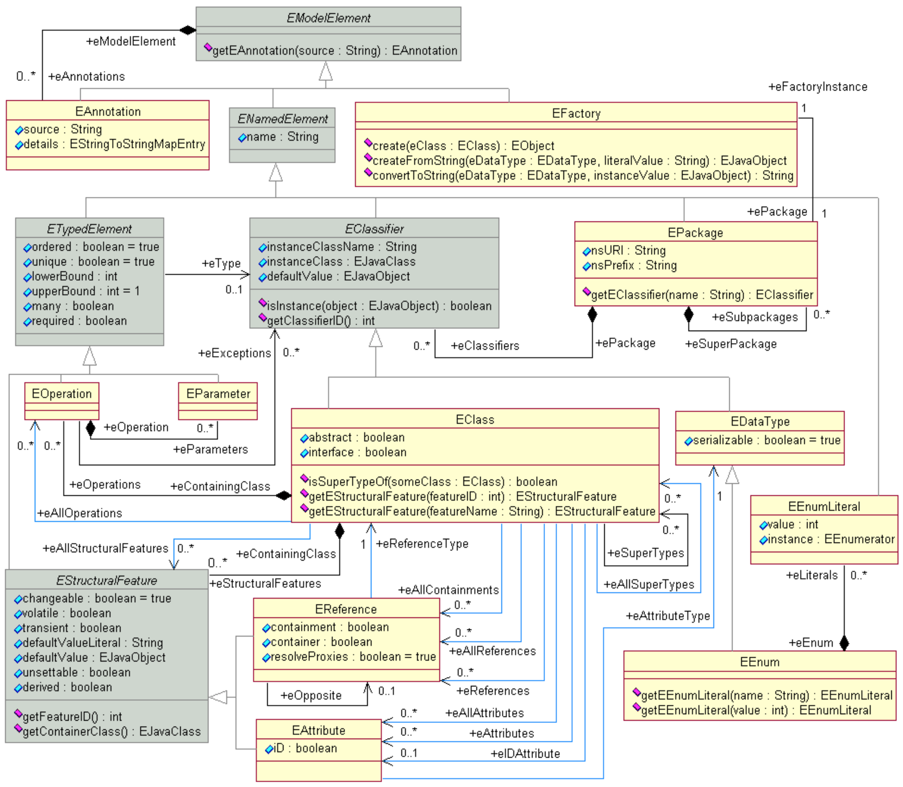
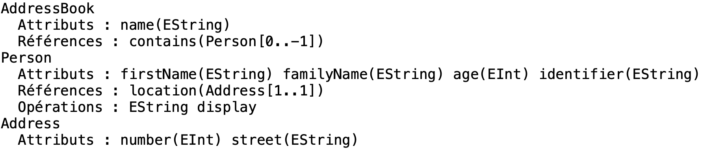

# Exercice 5 (EMF) : manipulation du métamodèle Ecore => LateBinding

Nous allons dans cet exercice manipuler le métamodèle Ecore afin de connaître la structure de notre modèle (puisque le modèle `AddressBook` est une instance du métamodèle Ecore). Nous allons également créer et modifier des instances de notre modèle via le métamodèle Ecore. Finalement nous sauvegarderons et chargerons ces instances afin d'obtenir un fichier XMI identique à l'exercice 4.

L’intérêt de cet exercice est d’utiliser une API de type *LateBinding* où les classes ne sont pas connues avant l’exécution du programme. Nous ferons donc appel explicitement au métamodèle Ecore. Nous présentons à titre indicatif le métamodèle Ecore.



## But

* Manipuler le métamodèle Ecore.
* Création d’instances via le métamodèle Ecore.
* Création d’instances via les outils d’Eclipse.

## Étapes à suivre

* Dans la classe `AddressBookTest` du fragment *eclipse.emf.addressbook.test* ajouter une méthode appelée `getAddressBookStructureTest`. L’objectif de cette méthode est d’afficher la structure complète de votre modèle en interrogeant le métamodèle. Le résultat attendu est donné par la capture d’écran ci-dessous.



Le point d’accès au métamodèle se fait par l’intermédiaire du package `AddressbookPackage`. Compléter le code donné ci-dessous afin d’obtenir le résultat escompté.

```java
@Test
public void getAddressBookStructureTest() {
    // Given
    StringBuffer content = new StringBuffer();

    AddressbookPackage addressbookPackage = AddressbookPackage.eINSTANCE;
    EList<EClassifier> eClassifiers = addressbookPackage.getEClassifiers();

    // À compléter...

    // When
    String string = content.toString();
    System.out.println(string);

    // Then
    Assert.assertEquals("AddressBook\n" +
            "  Attributs : name(EString) \n" +
            "  Références : contains(Person[0..-1])\n" +
            "Person\n" +
            "  Attributs : firstName(EString) familyName(EString) age(EInt) identifier(EString) \n" +
            "  Références : location(Address[1..1])\n" +
            "  Opérations : EString display \n" +
            "Address\n" +
            "  Attributs : number(EInt) street(EString) \n", string);
}
```

Pour l’instant nous avons vu que pour créer des instances du modèle nous devions utiliser les classes générées approche dite *EarlyBinding* car les classes sont connues avant l’exécution. Par réflexivité, il est possible de créer et modifier des instances du modèle sans avoir à manipuler explicitement les classes générées.

* Construire un projet EMF vide (**File -> Project... -> Eclipse Modeling Framework -> Empty EMF Project**) nommé *eclipse.emf.addressbook.latebinding*.

* Ouvrir le fichier *MANIFEST.MF* et ajouter la dépendance vers les plugin *org.junit* (4.12.0) et *org.eclipse.emf.ecore.xmi*.

* Créer ensuite le package `eclipse.emf.addressbook.latebinding` et finalement créer à l’intérieur la classe `AddressBookLateBindingTest`.

* Copier votre fichier *addressbook.ecore* réalisé dans le premier exercice dans le répertoire *model* de votre nouveau projet. À noter que ce nouveau plugin ne contient aucune dépendance vers les plug-ins créés précédents.

* Créer une méthode de test appelée `getAddressBookStructureWithoutGeneratedCodeTest` et dont l’objectif est 1) de charger le fichier *addressbook.ecore* afin de charger le modèle (accessible via le package racine) et 2) d’afficher la structure du modèle comme précisée sur la figure suivante.


```java
@Test
public void getAddressBookStructureWithoutGeneratedCodeTest() {
    // Given
    StringBuffer content = new StringBuffer();

    Resource.Factory.Registry reg = Resource.Factory.Registry.INSTANCE;
    Map<String, Object> m = reg.getExtensionToFactoryMap();
    m.put("ecore", new XMIResourceFactoryImpl());
    ResourceSet resourceSet = new ResourceSetImpl();
    URI fileURI = URI.createFileURI("model/addressbook.ecore");
    Resource resource = resourceSet.getResource(fileURI, true);

    EPackage ePackage = (EPackage) resource.getContents().get(0);

    // À compléter...

    // When
    String string = content.toString();
    System.out.println(string);

    // Then
    Assert.assertEquals("AddressBook\n" +
            "  Attributs : name(EString) \n" +
            "  Références : contains(Person[0..-1])\n" +
            "Person\n" +
            "  Attributs : firstName(EString) familyName(EString) age(EInt) identifier(EString) \n" +
            "  Références : location(Address[1..1])\n" +
            "  Opérations : EString display \n" +
            "Address\n" +
            "  Attributs : number(EInt) street(EString) \n", string);
}
```

* Créer une méthode appelée `saveAndLoadAddressBookWithoutGeneratedCodeTest` dont l’objectif est 1) de charger le fichier *addressbook.ecore* correspondant à notre modèle 2) de créer des instances identiques à celles créées pendant l'exercice 4 sans avoir à manipuler explicitement les classes Java du modèle 3) sauvegarder les instances dans un fichier XMI et 4) charger les instances depuis un fichier XMI.

```java
@Test
public void saveAndLoadAddressBookWithoutGeneratedCodeTest() throws IOException {
    // Given
    Resource.Factory.Registry reg = Resource.Factory.Registry.INSTANCE;
    Map<String, Object> m = reg.getExtensionToFactoryMap();
    m.put("ecore", new XMIResourceFactoryImpl());
    ResourceSet resourceSet = new ResourceSetImpl();
    URI fileURI = URI.createFileURI("model/addressbook.ecore");
    Resource resource = resourceSet.createResource(fileURI);
    resource.load(null);

    EPackage ePackage = (EPackage) resource.getContents().get(0);

    // À compléter.

    // When
    resourceSet = new ResourceSetImpl();
    resourceSet.getResourceFactoryRegistry().getExtensionToFactoryMap().put("xmi", new XMIResourceFactoryImpl());
    String pathname = "addressbookinstancesonlymodel.xmi";
    URI uri = URI.createURI("file:" + pathname);
    resource = resourceSet.createResource(uri);
    resource.getContents().add(addressBookInstance);
    HashMap<String, Object> opts = new HashMap<String, Object>();
    opts.put(XMIResource.OPTION_SCHEMA_LOCATION, true);
    resource.save(opts);
    // Then
    Assert.assertTrue(new File(pathname).exists());

    // When
    resourceSet = new ResourceSetImpl();
    resourceSet.getResourceFactoryRegistry().getExtensionToFactoryMap()
            .put("xmi", new XMIResourceFactoryImpl());
    Registry packageRegistry = resourceSet.getPackageRegistry();
    packageRegistry.put("http://addressbook/1.0", ePackage);

    uri = URI.createURI("file:" + pathname);
    resource = resourceSet.getResource(uri, true);
    resource.load(null);
    // Then
    EObject addressBookImpl = resource.getContents().get(0);
    EClass addressBook = addressBookImpl.eClass();
    // À compléter.
    // Récupérer les attributs name et contains 
    // Récupérer les valeurs des attributs name et contains pour l'instance addressBookImpl.
    Assert.assertEquals("Mon Carnet d'Adresses", addressBookImpl.eGet(nameAttribute));
    
    Assert.assertEquals("BARON", personImpl.eGet(familyName));
    Assert.assertEquals("Mickael", personImpl.eGet(firstName));
}
```

* Depuis l’éditeur de votre modèle Ecore (**Sample Ecore Model Editor**) créer des instances dynamiques (via l’option **Create Dynamic Instance** à partir de la classe `AddressBook`).